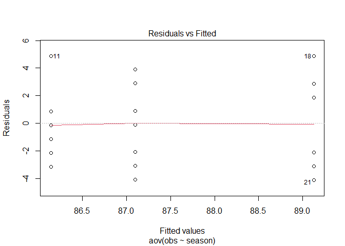
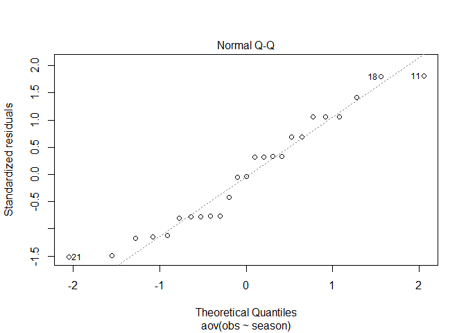
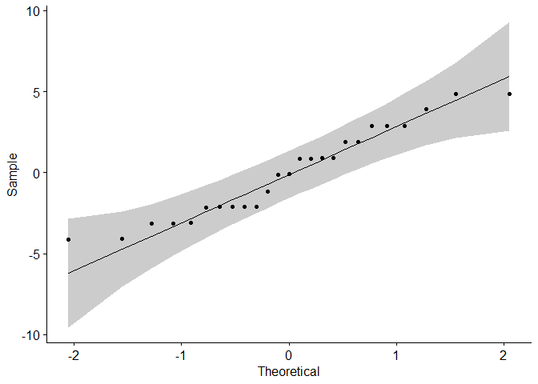
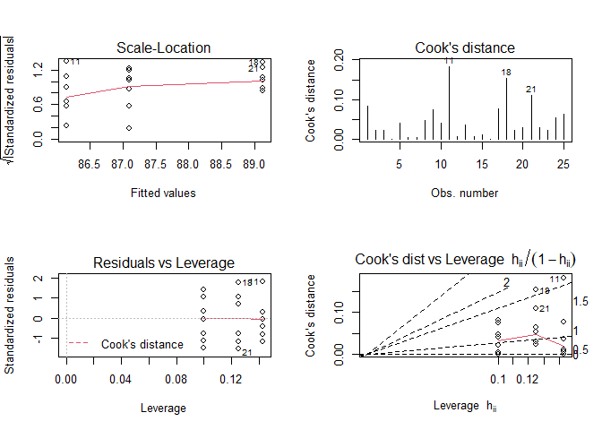

ANOVA in R
================
Abhishek Kumar
17 August 2020

In this tutorial, I will show how to implement ANOVA in R.

Here is a case study.

I belong to a golf club in my neighborhood. I divide the year into three golf seasons: summer (June–September), winter (November–March), and shoulder (October, April, and May). I believe that I play my best golf during the summer (because I have more time and the course isn’t crowded) and shoulder (because the course isn’t crowded) seasons, and my worst golf is during the winter (because when all of the part-year residents show up, the course is crowded, play is slow, and I get frustrated). Data from the last year are shown in the following table.

| Season   | 1   | 2   | 3   | 4   | 5   | 6   | 7   | 8   | 9   | 10  |
|----------|-----|-----|-----|-----|-----|-----|-----|-----|-----|-----|
| Summer   | 83  | 85  | 85  | 87  | 90  | 88  | 88  | 84  | 91  | 90  |
| Shoulder | 91  | 87  | 84  | 87  | 85  | 86  | 83  | NA  | NA  | NA  |
| Winter   | 94  | 91  | 87  | 85  | 87  | 91  | 92  | 86  | NA  | NA  |

Data Preparation
----------------

``` r
library(car)
```

    ## Loading required package: carData

``` r
library(ggpubr)
```

    ## Warning: package 'ggpubr' was built under R version 4.0.2

    ## Loading required package: ggplot2

    ## Warning: package 'ggplot2' was built under R version 4.0.2

Let's prepare the data for analysis:

``` r
obs <- c(83, 85, 85, 87, 90, 88, 88, 84, 91, 90,
         91, 87, 84, 87, 85, 86, 83,
         94, 91, 87, 85, 87, 91, 92, 86)
         
season <- c(rep("Summer", 10),
            rep("Shoulder", 7),
            rep("Winter", 8))

dat <- data.frame(obs, season)

str(dat)
```

    ## 'data.frame':    25 obs. of  2 variables:
    ##  $ obs   : num  83 85 85 87 90 88 88 84 91 90 ...
    ##  $ season: chr  "Summer" "Summer" "Summer" "Summer" ...

Anova in R
----------

``` r
mod <- aov(data = dat, obs~season)
summary(mod)
```

    ##             Df Sum Sq Mean Sq F value Pr(>F)
    ## season       2  35.61  17.804   2.121  0.144
    ## Residuals   22 184.63   8.392

Assumptions
-----------

*1. Homogeneity of variances*

The classical one-way ANOVA test requires an assumption of equal variances for all groups. The residuals versus fits plot can be used to check the homogeneity of variances.

``` r
plot(mod, 1)
```



In the above plot, there is no evident relationships between residuals and fitted values (the mean of each groups), which is good. So, we can assume the homogeneity of variances.

It’s also possible to use **Bartlett’s test** or **Levene’s test** to check the homogeneity of variances. I recommend Levene’s test, which is less sensitive to departures from normal distribution.

``` r
bartlett.test(obs ~ season, data = dat)
```

    ## 
    ##  Bartlett test of homogeneity of variances
    ## 
    ## data:  obs by season
    ## Bartlett's K-squared = 0.36038, df = 2, p-value = 0.8351

``` r
leveneTest(obs ~ season, data = dat)
```

    ## Warning in leveneTest.default(y = y, group = group, ...): group coerced to
    ## factor.

    ## Levene's Test for Homogeneity of Variance (center = median)
    ##       Df F value Pr(>F)
    ## group  2  0.9971  0.385
    ##       22

From the output above we can see that the p-value is not less than the significance level of 0.05. This means that there is no evidence to suggest that the variance across groups is statistically significantly different. Therefore, we can assume the homogeneity of variances in the different treatment groups.

In our example, the homogeneity of variance assumption turned out to be fine: the Levene test is not significant.

*2. Normality*

The normal probability plot of residuals is used to check the assumption that the residuals are normally distributed. In this plot, the quantiles of the residuals are plotted against the quantiles of the normal distribution. It should approximately follow a straight line.

``` r
plot(mod, 2)
```



In the above plot, as all the points fall approximately along this reference line, we can assume normality.

``` r
ggqqplot(residuals(mod))
```



Alternatively, the normality assumption can be checked using the Shapiro-Wilk test on the ANOVA residuals.

``` r
shapiro.test(mod$residuals)
```

    ## 
    ##  Shapiro-Wilk normality test
    ## 
    ## data:  mod$residuals
    ## W = 0.94121, p-value = 0.1579

``` r
#or
shapiro.test(residuals(mod))
```

    ## 
    ##  Shapiro-Wilk normality test
    ## 
    ## data:  residuals(mod)
    ## W = 0.94121, p-value = 0.1579

In the above test pvalue greater than significance level (0.05) finds no indication that normality is violated.

Other diagnostic plot

``` r
par(mfrow = c(2, 2))
plot(mod, 3)
plot(mod, 4)
plot(mod, 5)
plot(mod, 6)
```


