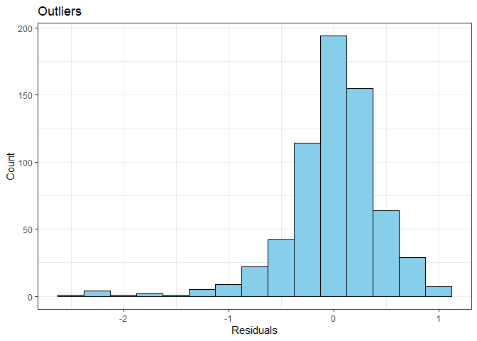

## Setup  
The present analysis is undertaken using the R programming language and environment 
for statistical computations. This analysis uses the R version 4.0.0 (Arbor Day) on 
a Windows 10 (x86_64 version) platform.

### Load packages  
For the present exploratory analysis, I will be using the `ggplot2`, `dplyr`
and `statsr` packages. The `ggplot2` package is very useful for visualisation whereas the
`dplyr` is used for cleaning and manipulating the data. The `statsr` package is 
useful for statistical hypothesis testing and inference making. These packages can be 
downloaded from the CRAN repository using the command `install.packages()` from 
the command line and then loaded by using the `library()` command as follows:


```r
library(ggplot2)
library(GGally)
library(dplyr)
library(statsr)
```

### Load data
The data for present analysis and its codebook is available from the following 
links:

 * [Movies dataset](https://d3c33hcgiwev3.cloudfront.net/_e1fe0c85abec6f73c72d73926884eaca_movies.Rdata?Expires=1598832000&Signature=HXLl4muhjmbw-yTvlY4W5U6D~TgtpBKyasAVpHry-dsCX0Lnp5QzO0-kA-cUhO5jiJp8odkJ94S8hNBDnVaMub~IjA2fctX-hWUuEIXfui~ayFr~0cpFXoWJCh5lq-dWAwNjvNpb9o8Z6gUWEfXIf1WjdpR8Cslksd4wu9sauqc_&Key-Pair-Id=APKAJLTNE6QMUY6HBC5A) [64 kb]
 * [Codebook](https://d3c33hcgiwev3.cloudfront.net/_73393031e98b997cf2445132f89606a1_movies_codebook.html?Expires=1598832000&Signature=hEb1GsKo58o7F1qPXGyCpXgxO~8e9hBuFGj0r7nOzKGuvx0jMan2Y3Zc4Yp24aAXD6R4Zp2neZ1Xy-9xfBqEaeBTQdFPQSjaJm6eGrwcx8~uRjxWFORtXhgNenUQXEjimh-Z2o7Mm3KxJkg-hHEuPxJ8vkMgBrqy1SEYjZrKeo8_&Key-Pair-Id=APKAJLTNE6QMUY6HBC5A) [862 kb]


```r
load("movies.Rdata")
dim(movies)
```

```
## [1] 651  32
```


* * *

## Part 1: Data

The `movies` dataset is comprised of 651 **randomly sampled** movies from 
[Rotten Tomatoes](http://www.rottentomatoes.com/) and [IMDB](http://www.imdb.com/) 
that are produced and released before 2016.This dataset
has 651 rows (observations) and 32 columns (variables). 

### 1.1 Generalization

* Since this dataset considers **random sampling** and samples are also less than 10%
of the population, we can be assume samples to be representative of population and,
therefore, *inferences can be generalized to the population* i.e. total movies.

### 1.2 Causation
* However, the *inference cannot be used to deduce the causation* because the results 
are obtained from the **observations** and specific experiments should be designed to 
infer the causation. Therefore, inferring causability from this observation study 
may not be accurate and it will require experimentaton for conclude causation.


* * *

## Part 2: Research question

Success of any movie depends on the number of its viewers and viewers often decide
to watch a movie based on ratings on particular sites as 
[Rotten Tomatoes](http://www.rottentomatoes.com/) and [IMDB](http://www.imdb.com/).
However, different websites are expected to have different methodology for rating a
particular movie. It could be of interest that whether different methodologies arrive 
at similar conclusions for rating a particular movie. This will be useful for 
decision making that whom's ratings are more accurate.

> 1. *Is there any associiation between the ratings of IMDB and Rotten tomatoes?*

> 2. *What are the different factors that affect Imdb ratings?*

* * *

## Part 3: Exploratory data analysis

> 1. *Is there any associiation between the ratings of IMDB and Rotten tomatoes?*

Firstly, we need to prepare the data and visualise it, if there are any indications 
of association.


```r
mov <- movies %>% 
      select(runtime, imdb_rating, imdb_num_votes, critics_score, audience_score)

label <- round(cor(mov$imdb_rating, mov$audience_score), 3)

ggplot(data = mov, aes(x = imdb_rating, y = audience_score)) + 
      geom_point(size = 4, alpha = 0.2) + 
      geom_smooth(method = "lm", size = 1.2, fill = "skyblue", alpha  = 0.2) +
      labs(x = "IMDB Rating", y = "Rotten Tomatoes Score") +
      geom_label(aes(label = paste("R =", label), x = 3, y = 100), fill = "grey98", 
                 size = 5) +
      theme_bw() +
      theme(axis.text = element_text(size = 12), axis.title = element_text(size = 13))
```

```
## `geom_smooth()` using formula 'y ~ x'
```

<!-- -->

So, this plot clearly indicates a strong, positive and significant correlation
among the `audience_score` of Rotten Tomatoes and `imdb_rating` of IMDB.Thus, it
is likely that the ratings given by Rotten Tomatoes and IMDB would be similar for 
a particular movie.

> 2. *What are the different factors that affect these ratings?*

For this, we will be first processing the data and then visualise scatterplots to
identify the correlated variables which can be included in building a model. Here,
I considered all relevant numerical variables and I will use a pair plot to 
visualise the correlation which will be helpful for **Identificatiion of collinear variables**  


```r
ggpairs(mov)
```

```
## Warning: Removed 1 rows containing non-finite values (stat_density).
```

```
## Warning in ggally_statistic(data = data, mapping = mapping, na.rm = na.rm, :
## Removing 1 row that contained a missing value

## Warning in ggally_statistic(data = data, mapping = mapping, na.rm = na.rm, :
## Removing 1 row that contained a missing value

## Warning in ggally_statistic(data = data, mapping = mapping, na.rm = na.rm, :
## Removing 1 row that contained a missing value

## Warning in ggally_statistic(data = data, mapping = mapping, na.rm = na.rm, :
## Removing 1 row that contained a missing value
```

```
## Warning: Removed 1 rows containing missing values (geom_point).

## Warning: Removed 1 rows containing missing values (geom_point).

## Warning: Removed 1 rows containing missing values (geom_point).

## Warning: Removed 1 rows containing missing values (geom_point).
```

<!-- -->

This plot suggests that all the variables are significanty and positively associated 
with each other. `imdb_rating`, `audience_score` and `critics_score` are highly 
correlated with each other and therefore can be considered as collinear. Hence, 
modelling audience score based on imdb_rating will not be useful.


```r
ggplot(data = movies, aes(y = genre, x = imdb_rating, fill = genre)) + 
      geom_boxplot(show.legend = FALSE) +
      scale_fill_brewer(palette = "Set3") +
      labs(x = "IMDB Rating", y = "Genre Categories") +
      theme_bw()
```

<!-- -->

This plot suggests that IMdb ratings vary with genre type, so this variable 
may be useful for model building and explaining the variations in Imdb ratings.

* * *

## Part 4: Modeling

### 4.1 Specify which variables to consider for the full model:

Firstly, I intended to include the following variables `genre`, `runtime`, 
`critics_score`, `best_pic_nom`, `best_pic_win`, `best_actor_win`, `best_actress_win`, 
`best_dir_win`, `top200_box` as explanatory variables for `imdb_rating`.


```r
mod.full <- lm(imdb_rating ~ genre + runtime + critics_score + 
                             audience_score + best_pic_nom + best_pic_win + 
                             best_actor_win + best_actress_win + best_dir_win +
                             top200_box, 
               data = movies)
summary(mod.full)
```

```
## 
## Call:
## lm(formula = imdb_rating ~ genre + runtime + critics_score + 
##     audience_score + best_pic_nom + best_pic_win + best_actor_win + 
##     best_actress_win + best_dir_win + top200_box, data = movies)
## 
## Residuals:
##      Min       1Q   Median       3Q      Max 
## -2.33344 -0.19757  0.04323  0.26991  1.18898 
## 
## Coefficients:
##                                  Estimate Std. Error t value Pr(>|t|)    
## (Intercept)                     3.2122349  0.1328265  24.184  < 2e-16 ***
## genreAnimation                 -0.3797970  0.1680123  -2.261  0.02413 *  
## genreArt House & International  0.2010354  0.1388045   1.448  0.14802    
## genreComedy                    -0.1503038  0.0777194  -1.934  0.05357 .  
## genreDocumentary                0.2644306  0.0962569   2.747  0.00618 ** 
## genreDrama                      0.0491384  0.0671348   0.732  0.46448    
## genreHorror                     0.0939901  0.1149294   0.818  0.41378    
## genreMusical & Performing Arts  0.0210666  0.1505808   0.140  0.88878    
## genreMystery & Suspense         0.2474427  0.0861844   2.871  0.00423 ** 
## genreOther                     -0.0617032  0.1322960  -0.466  0.64109    
## genreScience Fiction & Fantasy -0.1905717  0.1667185  -1.143  0.25344    
## runtime                         0.0048083  0.0010986   4.377 1.41e-05 ***
## critics_score                   0.0102794  0.0009489  10.833  < 2e-16 ***
## audience_score                  0.0339815  0.0013369  25.418  < 2e-16 ***
## best_pic_nomyes                -0.0229083  0.1219116  -0.188  0.85101    
## best_pic_winyes                 0.0613583  0.2131165   0.288  0.77351    
## best_actor_winyes               0.0307468  0.0554701   0.554  0.57957    
## best_actress_winyes             0.0588868  0.0616389   0.955  0.33977    
## best_dir_winyes                 0.0590200  0.0805795   0.732  0.46417    
## top200_boxyes                  -0.0140096  0.1262054  -0.111  0.91165    
## ---
## Signif. codes:  0 '***' 0.001 '**' 0.01 '*' 0.05 '.' 0.1 ' ' 1
## 
## Residual standard error: 0.4671 on 630 degrees of freedom
##   (1 observation deleted due to missingness)
## Multiple R-squared:  0.8201,	Adjusted R-squared:  0.8146 
## F-statistic: 151.1 on 19 and 630 DF,  p-value: < 2.2e-16
```

Here, many predictors are not significant therefore, inclusion of such variables
may not useful for model building.


```r
mod <- lm(imdb_rating ~ genre + runtime + critics_score + 
                             audience_score, 
               data = movies)
summary(mod)
```

```
## 
## Call:
## lm(formula = imdb_rating ~ genre + runtime + critics_score + 
##     audience_score, data = movies)
## 
## Residuals:
##      Min       1Q   Median       3Q      Max 
## -2.34430 -0.20090  0.03524  0.27085  1.17364 
## 
## Coefficients:
##                                  Estimate Std. Error t value Pr(>|t|)    
## (Intercept)                     3.1675348  0.1251241  25.315  < 2e-16 ***
## genreAnimation                 -0.3681453  0.1668808  -2.206   0.0277 *  
## genreArt House & International  0.1997289  0.1376430   1.451   0.1473    
## genreComedy                    -0.1410076  0.0766630  -1.839   0.0663 .  
## genreDocumentary                0.2611971  0.0945446   2.763   0.0059 ** 
## genreDrama                      0.0573713  0.0655556   0.875   0.3818    
## genreHorror                     0.0953283  0.1141619   0.835   0.4040    
## genreMusical & Performing Arts  0.0156689  0.1491699   0.105   0.9164    
## genreMystery & Suspense         0.2613679  0.0846405   3.088   0.0021 ** 
## genreOther                     -0.0599035  0.1311583  -0.457   0.6480    
## genreScience Fiction & Fantasy -0.1913924  0.1660092  -1.153   0.2494    
## runtime                         0.0052878  0.0010182   5.193 2.78e-07 ***
## critics_score                   0.0104037  0.0009376  11.096  < 2e-16 ***
## audience_score                  0.0339006  0.0013210  25.663  < 2e-16 ***
## ---
## Signif. codes:  0 '***' 0.001 '**' 0.01 '*' 0.05 '.' 0.1 ' ' 1
## 
## Residual standard error: 0.4657 on 636 degrees of freedom
##   (1 observation deleted due to missingness)
## Multiple R-squared:  0.8194,	Adjusted R-squared:  0.8157 
## F-statistic:   222 on 13 and 636 DF,  p-value: < 2.2e-16
```

So, our full model will include `genre`, `runtime`, `critics_score`, and 
`audience_score`.

### 4.2 Reasoning for excluding certain variables:

The excluded variables such as title, title_type, date of release, names of actor 
or director etc. would be independent of ratings of a movie. Therefore, these 
factors would not be useful for the model.

### 4.3 Reasoning for choice of model selection method:  

For this particular excercise we want to increase accuracy as much as possible for
accurate predictions. Therefore, the adjusted $R^2$ approach will be more useful
than the $p$-value approach because it tends to include more predictors in the 
final model. However, *forward* or *backward* selection startegies should not 
affect the models because both arrive at same selections.

### 4.4 Carrying out the model selection correctly:

Firstly, let's check the summary for our full model. Then, we will follow a 
backward step-by-step varibale removal.


```r
summary(lm(data = movies, imdb_rating ~ genre + runtime + critics_score + 
                             audience_score)
        )$adj.r.squared #full
```

```
## [1] 0.8157366
```

```r
summary(lm(data = movies, imdb_rating ~ genre + runtime + critics_score)
        )$adj.r.squared #full - audience_score
```

```
## [1] 0.6255103
```

```r
summary(lm(data = movies, imdb_rating ~ genre + runtime + 
                             audience_score)
        )$adj.r.squared #full - critics_score
```

```
## [1] 0.7804091
```

```r
summary(lm(data = movies, imdb_rating ~ genre + critics_score + 
                             audience_score)
        )$adj.r.squared #full - runtime
```

```
## [1] 0.8083692
```

```r
summary(lm(data = movies, imdb_rating ~ runtime + critics_score + 
                             audience_score)
        )$adj.r.squared #full - genre
```

```
## [1] 0.8052136
```

So elimination of any one of the varibale does not increased the adjusted $R^2$
for the model. Therefore, this approach suggest that this is the best model. However,
we can try a forward selection strategy by adding variables stepwise.


```r
summary(lm(data = movies, imdb_rating ~ genre + runtime + critics_score + 
                             audience_score)
        )$adj.r.squared #full
```

```
## [1] 0.8157366
```

```r
summary(lm(data = movies, imdb_rating ~ genre + runtime + critics_score + 
                             audience_score + title_type)
        )$adj.r.squared #full + title_type
```

```
## [1] 0.8156099
```

```r
summary(lm(data = movies, imdb_rating ~ genre + runtime + critics_score + 
                             audience_score + mpaa_rating)
        )$adj.r.squared #full + mpaa_rating
```

```
## [1] 0.8156545
```

```r
summary(lm(data = movies, imdb_rating ~ genre + runtime + critics_score + 
                             audience_score + studio)
        )$adj.r.squared #full + studio
```

```
## [1] 0.8287225
```

```r
summary(lm(data = movies, imdb_rating ~ genre + runtime + critics_score + 
                             audience_score + thtr_rel_year)
        )$adj.r.squared #full + thtr_rel_year
```

```
## [1] 0.8162955
```

```r
summary(lm(data = movies, imdb_rating ~ genre + runtime + critics_score + 
                             audience_score + thtr_rel_month)
        )$adj.r.squared #full + thtr_rel_month
```

```
## [1] 0.8162643
```

```r
summary(lm(data = movies, imdb_rating ~ genre + runtime + critics_score + 
                             audience_score + dvd_rel_year)
        )$adj.r.squared #full + dvd_rel_year
```

```
## [1] 0.812822
```

```r
summary(lm(data = movies, imdb_rating ~ genre + runtime + critics_score + 
                             audience_score + imdb_num_votes)
        )$adj.r.squared #full + imdb_num_votes
```

```
## [1] 0.8209607
```

```r
summary(lm(data = movies, imdb_rating ~ genre + runtime + critics_score + 
                             audience_score + critics_rating)
        )$adj.r.squared #full + critics_rating
```

```
## [1] 0.8190748
```

```r
summary(lm(data = movies, imdb_rating ~ genre + runtime + critics_score + 
                             audience_score + audience_rating)
        )$adj.r.squared #full + audience_rating
```

```
## [1] 0.8232743
```

```r
summary(lm(data = movies, imdb_rating ~ genre + runtime + critics_score + 
                             audience_score + director)
        )$adj.r.squared #full + director
```

```
## [1] 0.9057357
```

So, adding the variable `director`, `studio`, `audience_rating`, `imdb_num_votes`, 
`critics_rating` has increased the model adj.r.squared in that order. However, 
`critics_rating` is in turn developed from `critics_score`, therefore these are
collinear. Further, the `director` and `studio` variables may also make model 
unreliable because most the movies are produced by several indepedent directors and 
studios. Therefore, inclusion of these variables would not be a good idea.


```r
mod <- lm(data = movies, imdb_rating ~ genre + runtime + critics_score + 
                             audience_score + imdb_num_votes)
summary(mod)
```

```
## 
## Call:
## lm(formula = imdb_rating ~ genre + runtime + critics_score + 
##     audience_score + imdb_num_votes, data = movies)
## 
## Residuals:
##      Min       1Q   Median       3Q      Max 
## -2.39955 -0.19572  0.03305  0.25980  1.10929 
## 
## Coefficients:
##                                  Estimate Std. Error t value Pr(>|t|)    
## (Intercept)                     3.329e+00  1.286e-01  25.879  < 2e-16 ***
## genreAnimation                 -3.579e-01  1.645e-01  -2.176 0.029949 *  
## genreArt House & International  2.722e-01  1.367e-01   1.992 0.046844 *  
## genreComedy                    -1.236e-01  7.567e-02  -1.633 0.102956    
## genreDocumentary                3.618e-01  9.593e-02   3.772 0.000177 ***
## genreDrama                      1.011e-01  6.537e-02   1.546 0.122528    
## genreHorror                     1.111e-01  1.126e-01   0.987 0.324070    
## genreMusical & Performing Arts  1.181e-01  1.489e-01   0.793 0.427953    
## genreMystery & Suspense         2.740e-01  8.348e-02   3.282 0.001087 ** 
## genreOther                     -6.208e-02  1.293e-01  -0.480 0.631274    
## genreScience Fiction & Fantasy -2.034e-01  1.637e-01  -1.243 0.214467    
## runtime                         3.928e-03  1.050e-03   3.742 0.000199 ***
## critics_score                   1.026e-02  9.248e-04  11.095  < 2e-16 ***
## audience_score                  3.241e-02  1.345e-03  24.103  < 2e-16 ***
## imdb_num_votes                  8.203e-07  1.855e-07   4.422 1.15e-05 ***
## ---
## Signif. codes:  0 '***' 0.001 '**' 0.01 '*' 0.05 '.' 0.1 ' ' 1
## 
## Residual standard error: 0.459 on 635 degrees of freedom
##   (1 observation deleted due to missingness)
## Multiple R-squared:  0.8248,	Adjusted R-squared:  0.821 
## F-statistic: 213.6 on 14 and 635 DF,  p-value: < 2.2e-16
```

So, the above model gives the highest adjusted r squared value. Therefore, we will
select this model.

$$\begin{align} \
\widehat {imdb\_rating} = 
& 3.329 - 0.036 \times genre_{Animation} + 0.272 \times genre_{ArtHouseInt} - 0.123 \times genre_{Comedy}\\
& + 0.362 \times genre_{Documentary} + 0.101 \times genre_{Drama} + 0.111 \times genre_{Horror}\\
& + 0.118 \times genre_{MusicPerformaceArts} + 0.274 \times genre_{MysterySuspense} - 0.062 \times genre_{Other}\\
& - 0.203 \times genre_{ScienceFictionFantasy} + 0.0039 \times runtime + 0.010 \times critics\_score\\
& + 0.0324 \times audience\_score + 0.000 \times imdb\_num\_votes\\
\end{align}$$


### 4.5 Model diagnostics:  

#### 4.5.1 Linear Association


```r
ggplot(data  = mod, aes(x = mod$fitted.values, y = mod$residuals)) + 
      geom_point(size = 4, alpha = 0.3, color = "skyblue") +
      geom_hline(yintercept = 0, color = "red", size = 1) +
      labs(x = "fitted", y = "residuals", title = "Linear Associatiion") +
      theme_bw()
```

<!-- -->

The residuals are randomly distributed though at lower end some are not well fitted. 
Since our data has sufficiently large number of samples, this may not
be violation of assumptions

#### 4.5.2 Constant Variance

Again , the above plot of residuals vs fitted values shows a slight fan-shaped 
distribution at lower end, however, sufficiently large sample size can compensate 
this slight divergence.


```r
ggplot(data  = mod, aes(x = mod$fitted.values, y = abs(mod$residuals))) + 
      geom_point(size = 4, alpha = 0.3, color = "skyblue") +
      geom_smooth(method = "lm", color = "red", alpha = 0.3)+
      labs(x = "Fitted", y = "Absolute Residuals", title = "Constant Variance") +
      theme_bw()
```

```
## `geom_smooth()` using formula 'y ~ x'
```

<!-- -->

This plot suggests that there is more evident variability for fitted values that 
are smaller.

#### 4.5.3 Normality of residuals


```r
ggplot(data = mod, aes(sample = mod$residuals)) + 
      geom_qq(size = 4, alpha = 0.3, color = "skyblue") + 
      geom_qq_line(color = "red", size = 1.2) +
      labs(x = "fitted", y = "residuals", title = "Normality of Residuals") +
      theme_bw()
```

<!-- -->

The residuals are fairly normal but at the lower end they diverges from the 
normality. Therefore, this data is left skewed, however, large number of samples
can overcome this skewness of data.

#### 4.5.4 Outliers


```r
ggplot(data = mod, aes(x = mod$residuals)) + 
      geom_histogram(color = "black", fill = "skyblue", bins = 15) +
      labs(x = "Residuals", y = "Count", title = "Outliers")+
      theme_bw()
```

<!-- -->

So, this histogram of residuals suggests that the residuals are left skewed. Since
this is a very large data set, only particularly extreme observations would be a 
concern in this particular case. There are no extreme observations that might 
cause a concern.

#### 4.5.5 Independence

As samples are drawn randomsly, we can assume independence.

So, our model fairly follows the assumptions of linear regression models.

### 4.6 Interpretation of model coefficients:

* If all other held constant, the imdb rating for a comedy movie is expected to be 0.034 
times higher than an Action and Adeventure movie on average.

* If all other held constant, the imdb rating for a movie is expected to be 0.01 times 
higher for every unit increase in critics score on average. 

* Similarly, If all other variables are held constant, the imdb ratings are expected 
to be 0.0324 times higher for every unit increase in audience score on average.

* The intercept describes the average outcome of response variable $y$ if the $x = 0$.
So our final model suggests that if all other variables are forced to be 0, than
the average imdb rating will be 3.17. Thus, our model predicts an imdb rating of
3.17 for a particular movied even if does not get a score in any variable.

* * *

## Part 5: Prediction


### 5.1 Reference(s) for where the data for this movie come from

I have picked the movie `Deadpool` for prediction. This was a *Sci-Fi* movie. The
data about this movie can be accessed from the following links:

* [IMDb](https://www.imdb.com/title/tt1431045/)
* [Rotten Tomatoes](https://www.rottentomatoes.com/m/deadpool)

From these website url for the movie, I have colected the relevant data which is
useful for prediction and stored in a neew variabled called as `movie.new`.


```r
movie.new <- data.frame(title ="Deadpool", title_type ="", genre ="Science Fiction & Fantasy", 
                        runtime = 108, mpaa_rating = "", studio = "", imdb_rating = 8.0, 
                        imdb_num_votes = 881589, critics_rating = "Certified Fresh",
                        audience_rating = "", critics_score = 85, audience_score = 90)
```

### 5.2 Correct prediction

For prediction, I have used the base function `prediction()` as follows:


```r
predict(object = mod, newdata = movie.new, interval = "prediction", level = 0.95)
```

```
##       fit      lwr     upr
## 1 8.06272 7.075301 9.05014
```

The original imdb rating for the movie at the website is 8.0, which is very much close 
to the predicted imdb_rating.So for this particular case model accuracy is
$\frac {8.0}{8.06} \times 100 = 99.26\%$

### 5.3 Correct quantification of uncertainty around this prediction with a prediction interval

The 95% prediction intervals were genrated using the prediction function and setting
the significance level at 95% (0.95). The 95% prediction interval comes out to be
7.075 to 9.05 which is a broader interval suggesting the fmoderate uncertainity in 
the prediction.

### 5.4 Correct interpretation of prediction interval

So, we are 95% confident that the imdb rating predicted by this model for this 
particular movie to be 7.07 to 9.05 on avergae.

**Alternatively**

$$\begin{align} \
\widehat {imdb\_rating} = 
& 3.329 - 0.036 \times genre_{Animation} + 0.272 \times genre_{ArtHouseInt} - 0.123 \times genre_{Comedy}\\
& + 0.362 \times genre_{Documentary} + 0.101 \times genre_{Drama} + 0.111 \times genre_{Horror}\\
& + 0.118 \times genre_{MusicPerformaceArts} + 0.274 \times genre_{MysterySuspense} - 0.062 \times genre_{Other}\\
& - 0.203 \times genre_{ScienceFictionFantasy} + 0.0039 \times runtime + 0.010 \times critics\_score\\
& + 0.0324 \times audience\_score + 0.00000082 \times imdb\_num\_votes\\
\end{align}$$


```r
genre <- 1
runtime <- 108
critics_score <- 85
audience_score <- 90
imdb_num_votes <- 881589

imdbrating <- 3.329 - 0.2034*genre +0.00392*runtime + 0.01026*critics_score + 
      0.03241*audience_score + 0.00000082*imdb_num_votes

round(imdbrating, 2)
```

```
## [1] 8.06
```

* * *

## Part 6: Conclusion

* **Conclusion:** `Correlation` is useful for estimating the association between 
two variables whereas `Regression` is useful for model building and prediction 
of outcomes using a set of explanatory variables. These models and there predictions
are find many applications in the real world such as prediction of elections,movies 
rating etc. These techniques can be really powerful for some cases where model
accuracy can be achieved over 90%. 

* **Cohesive synthesis of findings:** This particular case-study suggest that there 
is a strong, positive and significant relationship between the movies ratings of `IMDB`
and `Rotten Tomatoes`. However, there are variability and differences for movies 
recieving poor ratings. The `IMDB ratings` depend on several factors, but some factors
can be useful for modelling an dprediction. It appears that `genre`, `audience score`,
`critics score` and `runtime` are important factors that infuence the rating of
any movie.

* **Discussion of shortcomings:** Though linear models can approximate the 
relationship between two variables, these models have real limitations. Afterall,
these are simply modeling frameworks and the truth can be far more complex
than our simple expectations. There is always scope of several uncertainities in
the form of model selection, variable selection, and accuracy of the models. we never 
know all the useful predictors and therefore there is always uncertainity. Further,
Model accuracy can never be achieved 100% due to realistic limitation. Moreover, 
we do not know how the data will behave outside of our limited scope. Similarly,
non-linear relationships can pose challange to modelling and accurate predictions.

